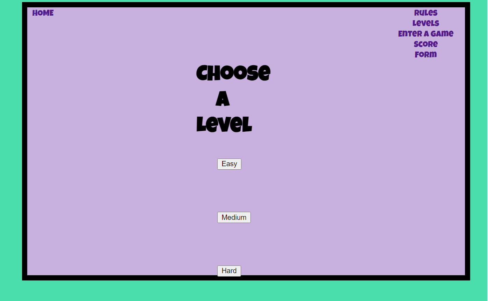
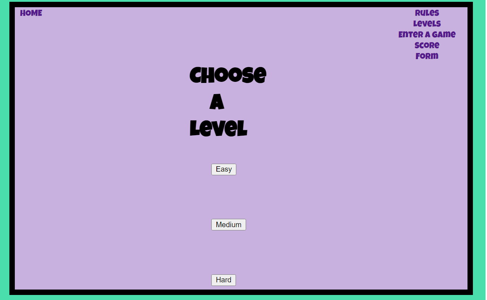

# Paw Patrol Kids Quiz.

The purpose of this website is to design a Quiz based website for children about the topic of `Paw Patrol`.
 
HTML, CSS and JavaScript has been used together for this project to produce a multiple questioned Quiz.
***
***
### Table of Contents.
* [User Experience](#user-experience)
	- [Wireframe](#wireframe)
* [Features](#features)
	- [Introduction Page](#introduction-page)
	- [New Issues](#new-issues)
	- [Volume 1-9](#volume-1-9)
	- [About the Author](#about-the-author)
	- [Subscribtion Form](#subscribtion-form)
	- [Footer](#footer)
	- [Future features](#future-features)
* [Testing](testing.md)
* [Design](#design)
	- [Colour Scheme](#colour-scheme)
	- [Typography](#typography)
* [Clone Website](#clone-website)
* [Deployment](#deployment)
* [Technologies](#technologies)
***
## Technologies.
[Favicon Icon](https://www.favicon-generator.org/) 
One of the characters in Paw Patrol is Everest. I used her colours throughout the website and for the favicon icon on the website after using the generator on the picture file. 

[Bootstrap](https://www.w3schools.com/bootstrap/bootstrap_get_started.asp)

### Credits

* Fonts from [Google Fonts](https://fonts.google.com/)
* Icons from [Font Awesome](https://fontawesome.com/)
* Wireframe from [Balsamiq](https://balsamiq.com/)
* [Favicon Icon](https://www.favicon-generator.org/) generator wesbite
* Favicon [image](https://www.bing.com/images/search?view=detailV2&ccid=%2BJyjEgf8&id=1C9235A2E43F8DACE3ABFA5ECA46B0C6EA59D9CF&thid=OIP.-JyjEgf8_qN5SGjxre2cngHaIB&mediaurl=https%3A%2F%2Fwww.vippng.com%2Fpng%2Fdetail%2F223-2230436_stickerbygoodcat30-everest-pawpatrol-everestpawpatrol-paw-patrol-everest.png&exph=996&expw=920&q=everest+paw+patrol&simid=608045310985327084&form=IRPRST&ck=D75FA36506DA9C1F967833C435131981&selectedindex=5&ajaxhist=0&ajaxserp=0&vt=0&sim=11&cdnurl=https%3A%2F%2Fth.bing.com%2Fth%2Fid%2FR.f89ca31207fcfea3794868f1aded9c9e%3Frik%3Dz9lZ6sawRspe%252bg%26pid%3DImgRaw%26r%3D0) source

Issue

Fix

help with quiz
https://www.geeksforgeeks.org/how-to-create-a-simple-javascript-quiz/
